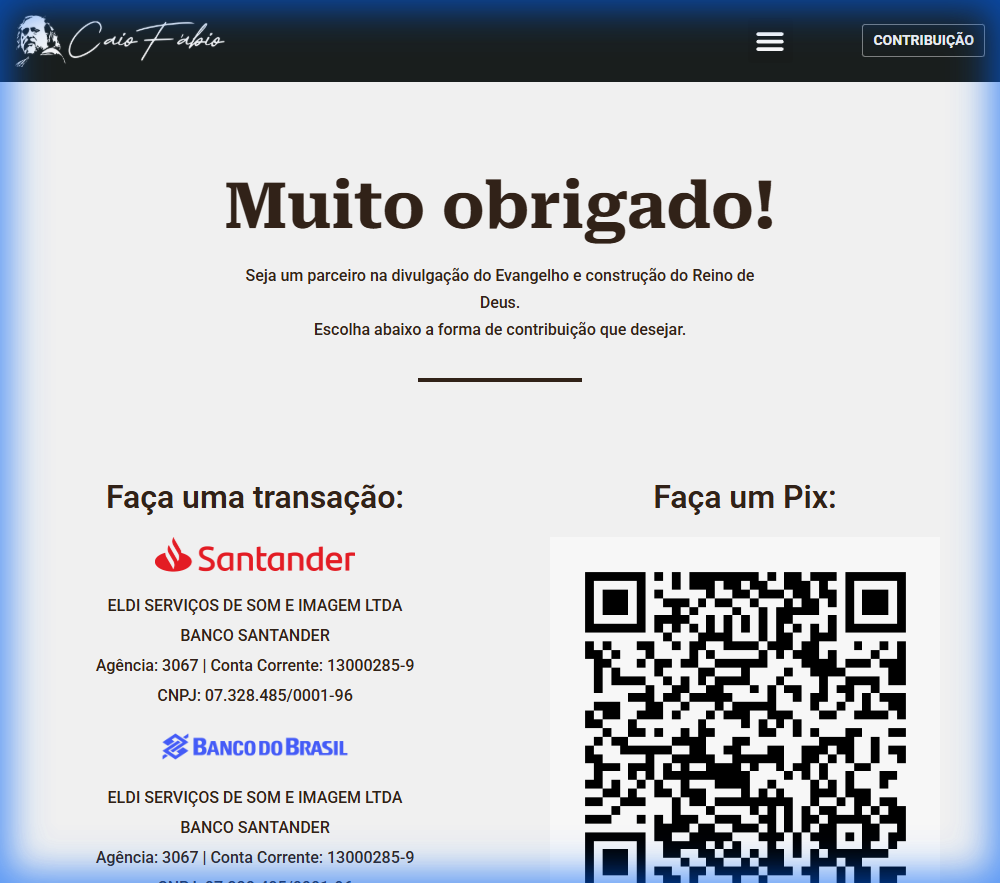
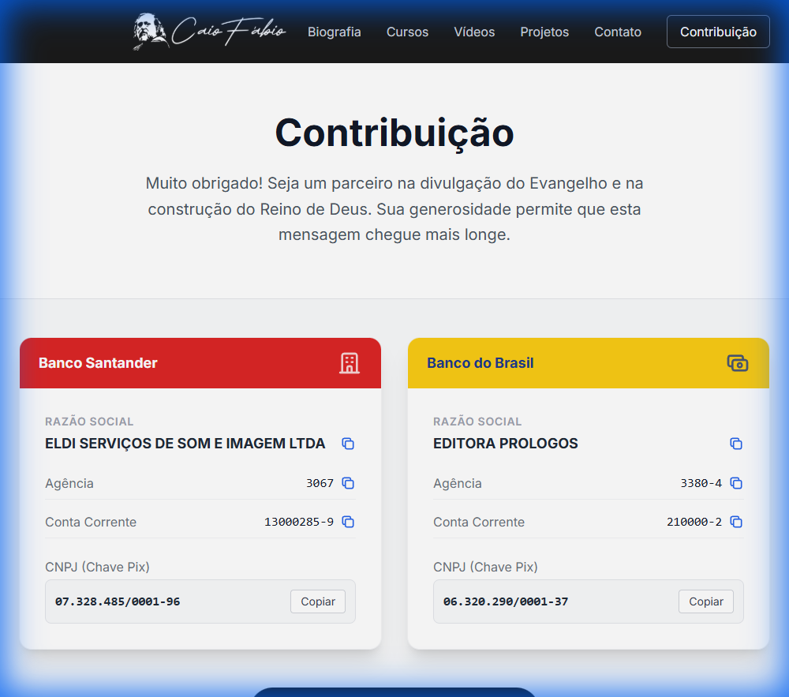

# Redesign da Página de Contribuição - Caio Fábio

Este repositório apresenta uma proposta de **modernização e redesign** da Landing Page de doações e contribuições do ministério Caio Fábio. O objetivo é oferecer uma experiência de usuário (UX) aprimorada, com um design visual mais limpo, profissional e responsivo, alinhado às tendências modernas de desenvolvimento web.

🔗 **[Ver Protótipo Online](https://marcellocunha.github.io/contribuicao/)**

---

## 📋 Visão Geral do Projeto

A página original, construída sobre a plataforma WordPress/Elementor, cumpre seu papel funcional, mas apresenta oportunidades de melhoria em termos de hierarquia visual, acessibilidade e performance.

Esta proposta reconstrói a interface utilizando tecnologias nativas e leves, focando em:
*   **Performance:** Carregamento instantâneo.
*   **Acessibilidade:** Cores com melhor contraste e botões de ação claros.
*   **Usabilidade:** Funcionalidades intuitivas como "Copiar chave Pix/Conta" com feedback visual imediato.

## 🚀 Tecnologias Utilizadas

O projeto foi desenvolvido com uma stack moderna e minimalista, garantindo facilidade de manutenção e alta performance:

*    **HTML5 Semântico**: Estrutura robusta e otimizada para SEO.
*    **Tailwind CSS (CDN)**: Framework "utility-first" para estilização rápida, responsiva e consistente.
*    **Vanilla JavaScript**: Lógica leve para interações (menus, toasts, área de transferência) sem dependência de bibliotecas pesadas.

---

## 🆚 Comparativo: Antes vs. Depois

Abaixo, apresentamos um comparativo visual entre a versão atual e a proposta de redesign.

### Página Original (Referência)
*Design funcional mas básico, com layout padrão do Elementor.*


### Nova Proposta (Protótipo)
*Design "Clean", foco na tipografia, cards distintos para cada método de doação e Dark Mode no cabeçalho/rodapé para sofisticação.*


---

## ✨ Principais Melhorias Implementadas

1.  **Interface Moderna (UI)**
    *   Adoção de uma paleta de cores sóbria mas convidativa (Dark Mode + Detalhes em Azul/Vermelho).
    *   Tipografia `Inter` para melhor legibilidade em todas as telas.
    *   Cards com sombreamento suave e efeitos de *hover* para interatividade.

2.  **Experiência do Usuário (UX)**
    *   **Botão "Copiar" Inteligente**: Ao invés de o usuário ter que selecionar e copiar manualmente os números das contas ou chaves Pix, um botão dedicado faz isso com um clique e exibe uma notificação ("Toast") de confirmação.
    *   **Responsividade Total**: Layout adapta-se perfeitamente de celulares a monitores ultrawide.

3.  **Código Limpo**
    *   Estrutura de código organizada e comentada.
    *   Remoção do peso excessivo de plugins de CMS.

## 🔧 Como Executar Localmente

Para visualizar este projeto em sua máquina:

1.  Clone este repositório:
    ```bash
    git clone https://github.com/marcellocunha/contribuicao.git
    ```
2.  Navegue até a pasta do projeto:
    ```bash
    cd contribuicao
    ```
3.  Abra o arquivo `index.html` em seu navegador preferido.

---

## 🔗 Referências

*   **Página Original**: [https://caiofabio.com.br/pagina-de-contribuicao/](https://caiofabio.com.br/pagina-de-contribuicao/)
*   **Repositório do Protótipo**: [https://github.com/marcellocunha/contribuicao](https://github.com/marcellocunha/contribuicao)

---
© 2025 Desenvolvido como proposta de melhoria de UX/UI.
